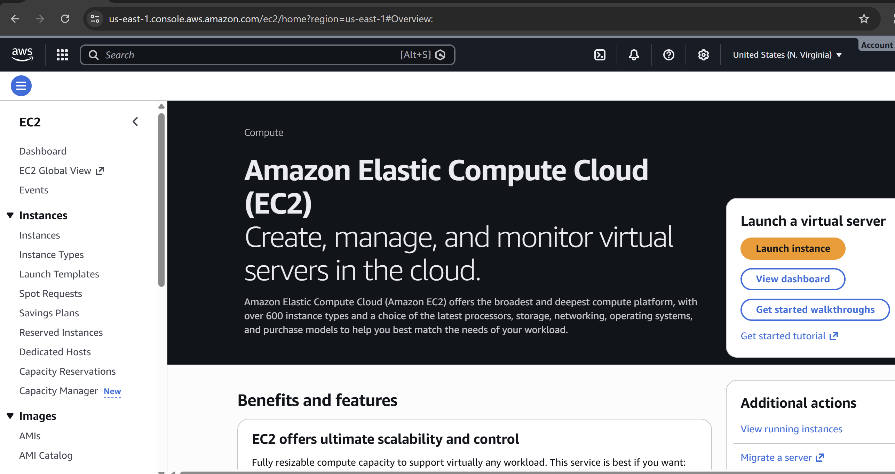
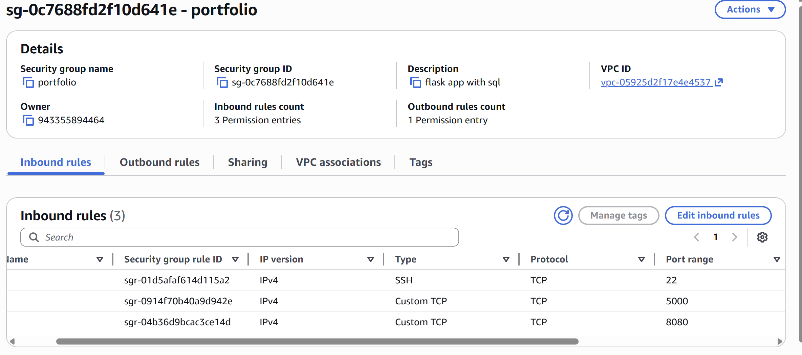

# Devops 2tier application
Note: i got this on some youtube channel so im trying replicate the things i learnt from this

---

## 1. Create a simple 2 tier application using docker-compose

### prequisities

vm on cloud(EC2) on top of it you have to install jenkins(for CI/CD), Docker to containerize the apllication & Docker compose to manange the multiple container on same host  
(we are runing the flask app & mysql basically 1container for flask app and 1 for mysql)

---

### EC2 setup steps

- sign-in to aws console  
- search for ec2 instance
- you will land this page below
  

- click on launch instances  
- give the instance name  
- select Application and OS Images (Amazon Machine Image)  
  ubuntu 22.04 LTS free tier


- choose instance type t3.micro (choose free tier eligible)  
- keypair required for the login  

### Security group configuration

- configure security group

- allow inbound traffic for:  
  - port 22 (ssh)  
  - port 8080 (jenkins)  
  - port 5000 (flask app)
  


`tip: once you login first create a SG, while launching ec2 you can select the existing SG`

- also ensure Auto-assign public IP is enabled  
- leave rest default & launch instance  


### install Docker, 
```bash
sudo apt update && sudo apt install docker.io -y
sudo apt update && sudo apt  install docker-compose
sudo docker-compose --version

````
### to install jenkins, you need the java to be installed on ec2

```bash
sudo apt update
sudo apt install openjdk-21-jdk -y
java -version
```

then install jenkins:

```bash
sudo wget -O /etc/apt/keyrings/jenkins-keyring.asc \
  https://pkg.jenkins.io/debian-stable/jenkins.io-2023.key
echo "deb [signed-by=/etc/apt/keyrings/jenkins-keyring.asc]" \
  https://pkg.jenkins.io/debian-stable binary/ | sudo tee \
  /etc/apt/sources.list.d/jenkins.list > /dev/null
sudo apt update
sudo apt install jenkins
```

Retrieve the initial admin password:

```bash
sudo cat /var/lib/jenkins/secrets/initialAdminPassword
```

Access the Jenkins dashboard at
`http://<ec2-public-ip>:8080`.

Paste the password, install suggested plugins, and create an admin user.

---

## 2. creating pipeline in jenkins, important step in the process which automates the CI/CD process

* once you login you will land on jenkins dashboard
* click on new item on left side
* give the name of the pipeline project & select pipeline & click ok
* scroll down to pipeline section
* in definition select pipeline from scm
* in scm select git
* in repository url paste the github repo link
* in branch specify main(remove master)
* click on save
* click on build now on left side
* you can see the build getting triggered
* you see the build status failed in console output you have to debug

the error is because of permission denied for docker command
to fix that run below command:(in ec2 instances)

```bash
sudo usermod -aG docker jenkins
```

(this command will add the jenkins user to the docker group so he can run docker commands)

then restart jenkins service:

```bash
sudo systemctl restart jenkins
```

now again click on build now
you can see the build getting triggered successfully
you can see the 2tier application getting deployed

access the flask app @
`http://<ec2-public-ip>:5000`

you can see the app is connected to mysql database

you can verify the mysql container is running by:

```bash
sudo docker ps
```

(in the ec2 instance)

you can see 2 containers running one for flask app another for mysql database

---

## 3. Conclusion:

you have successfully created a simple 2tier application using docker-compose and automated the deployment process using jenkins pipeline.

you may wondering where is the automation, that we haven't configured yet will do this in this final step

as soon as the developer push the code to repo the pipeline has to trigger

for that go to the github repo

* click on repo settings
* click on webhooks on left side
* click on add webhook
* in payload url paste:
  `http://<ec2-public-ip>:8080/github-webhook/`

now go to jenkins pipeline project

* click on configure
* scroll down to the pipeline section
* in build triggers select github hook trigger for gitscm polling
* click on save

now go to the github repo

* make some changes to the code and push the changes

you can see the jenkins pipeline getting triggered automatically
you can see the changes reflected in the flask app

congratulations you have successfully created a simple 2tier application using docker-compose and automated the deployment process using jenkins pipeline with github webhook integration.

---

## 4. References:

* [https://docs.docker.com/compose/install/](https://docs.docker.com/compose/install/)
* [https://www.jenkins.io/doc/book/installing/linux/#debianubuntu](https://www.jenkins.io/doc/book/installing/linux/#debianubuntu)
* [https://www.jenkins.io/doc/book/pipeline/syntax/](https://www.jenkins.io/doc/book/pipeline/syntax/)
* [https://www.youtube.com/watch?v=X6Kw2_wZr1E](https://www.youtube.com/watch?v=X6Kw2_wZr1E)
* [https://github.com/nischai-mu/DevOps-Project-Two-Tier-Flask-App/tree/main](https://github.com/nischai-mu/DevOps-Project-Two-Tier-Flask-App/tree/main)

